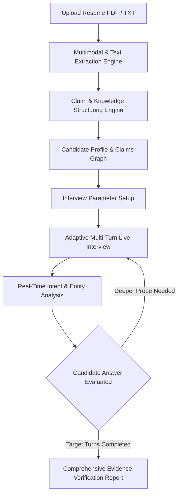
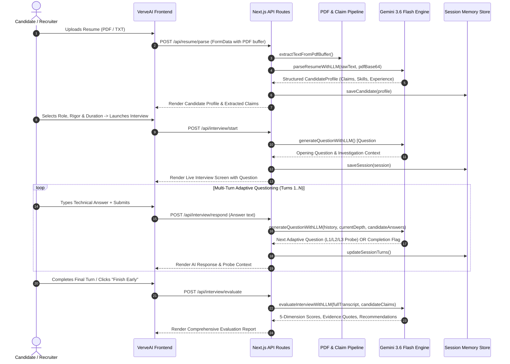
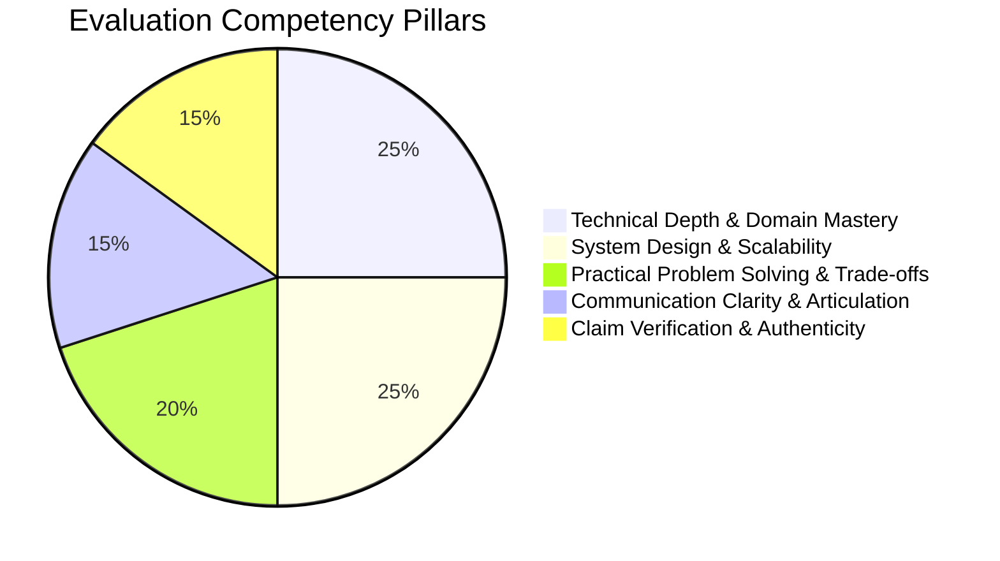

# VerveAI: Autonomous Adaptive Technical Interview Engine
### Comprehensive System Architecture, Workflow & Technical Specification

---

## 1. Executive Summary & Vision

**VerveAI** is an autonomous, AI-driven adaptive technical interviewing platform. Unlike traditional static question banks or simple prompt-response wrappers, VerveAI functions as an end-to-end cognitive interview system that:
1. **Parses & Structures Resumes**: Extracts quantifiable claims, architectural choices, scale metrics, and core competencies from candidate PDFs.
2. **Generates Tailored Inquiries**: Formulates dynamic, contextual questions anchored directly to the candidate's verified background rather than generic templates.
3. **Conducts Live Multi-Turn Adaptive Probing**: Progressively deepens technical probes (Level 1 $\rightarrow$ Level 2 $\rightarrow$ Level 3) based on the depth, clarity, and trade-offs in candidate responses.
4. **Delivers Evidence-Based Calibration Reports**: Outputs an objective 5-dimension scorecard with verbatim candidate quotes, claim verification statuses, and suggested on-site follow-ups.



---

## 2. System Architecture & Tech Stack

### Technology Matrix

| Layer | Technologies / Libraries | Rationale |
| :--- | :--- | :--- |
| **Frontend UI / Framework** | Next.js 14 (App Router), React 18, TypeScript | High-performance server rendering, API routing, and state hydration |
| **Styling & Design System** | Vanilla CSS Tokens, Glassmorphism, Dark Mode Palette | Zero dependency bloat, responsive viewport scaling, custom micro-animations |
| **AI Intelligence Engine** | Google Gemini API (`gemini-3.6-flash`), OpenAI GPT-4o, Groq (LLaMA 3.3 70B) | High speed, multimodal document reading, and robust JSON mode outputs |
| **PDF Extraction Pipeline** | `pdf-parse` v2.4.5, Native Node `zlib` stream decompressor, Gemini Multimodal `inlineData` | Resilient fallback hierarchy for complex multi-column PDFs and OCR |
| **Local Semantic Engine** | Deterministic Knowledge Graph, Regex Tokenizer, Jaccard/TF-IDF Scoring | Zero-latency fallback when external AI APIs or quotas are unavailable |
| **State & Persistence** | In-Memory Session Store (`memoryStore`), LocalStorage client caching | Low-friction testability with modular interface for Postgres / Redis |

---

## 3. End-to-End Workflow Pipeline



---

## 4. Key Component Breakdown

### A. PDF Parsing & Multimodal Extraction Pipeline (`src/lib/engine/pdfParser.ts`)
- **Primary Tier**: Evaluates PDF structure using `pdf-parse` v2 (`PDFParse` class API with `.getText()`).
- **Multimodal Tier**: Encodes binary PDF into Base64 `inlineData` (`application/pdf`) and passes it directly to Gemini Flash for layout-aware OCR.
- **Sanitization & Normalization**: Strips CID markers, BOM artifacts, octal escape sequences (`\001\000`), and resolves hyphenated line splits (`micro-\nservices` $\rightarrow$ `microservices`).

### B. Claim Extraction Engine (`src/lib/engine/claimExtractor.ts`)
- Scans candidate text for quantifiable metrics ($P95$ latencies, requests/sec, concurrent users, financial throughput).
- Normalizes claims into distinct categories:
  - `Scale & Traffic`
  - `Database & Storage`
  - `Performance & Latency`
  - `Reliability & CI/CD`
  - `Architecture & Design`
  - `Leadership & Mentorship`
- Cleans and structures raw bullet points into complete, polished English assertions.

### C. Unified LLM Service (`src/lib/services/llmService.ts`)
- **Dynamic Model Dispatcher**: Automatically detects and uses `gemini-3.6-flash`, OpenAI, or Groq with graceful fallback to the local semantic engine.
- **Strict JSON Generation**: Enforces structured schema outputs with response repair mechanisms for uninterrupted conversational continuity.
- **Multimodal Payload Handler**: Assembles multimodal text + PDF binary attachments in Google Generative AI API payloads.

### D. Adaptive Question Generator (`src/lib/engine/adaptiveEngine.ts`)
- Implements a 3-tier depth progression algorithm:
  - **Level 1 (Foundational Exploration)**: Explores candidate's high-level responsibilities and system architecture choices.
  - **Level 2 (Implementation Mechanics)**: Probes concrete technologies, internal mechanics, protocol choices, and configuration parameters.
  - **Level 3 (Failure Modes & Trade-offs)**: Challenges candidate on edge cases, disaster recovery, concurrency bottlenecks, and architectural trade-offs.

---

## 5. Evaluation Report Dimensions

Each candidate evaluation produces quantitative ratings (0–100) and qualitative analysis across 5 core competency pillars:



1. **Technical Depth & Domain Mastery**: Understanding of low-level abstractions, concurrency models, and runtime performance.
2. **System Design & Scalability**: Ability to architect distributed, fault-tolerant, and horizontally scalable services.
3. **Problem Solving & Trade-offs**: Pragmatic decision-making between latency vs. consistency, build vs. buy, and technical debt.
4. **Communication & Articulation**: Structural clarity, conciseness, and precision when explaining complex technical concepts.
5. **Claim Verification & Authenticity**: Direct correlation between resume bullet points and verbal answers with verbatim quote citations.

---

## 6. Directory Structure Overview

```text
interview-ai/
├── src/
│   ├── app/
│   │   ├── api/
│   │   │   ├── interview/
│   │   │   │   ├── start/route.ts        # Initialize interview session
│   │   │   │   ├── respond/route.ts      # Process candidate answer & generate probe
│   │   │   │   └── evaluate/route.ts     # Synthesize final score & evidence report
│   │   │   └── resume/
│   │   │       └── parse/route.ts        # Parse PDF/TXT and extract claims
│   │   ├── globals.css                   # Responsive design tokens & animations
│   │   ├── layout.tsx                    # Root layout with viewport metadata
│   │   └── page.tsx                      # 4-Step interactive interview orchestrator
│   ├── components/
│   │   ├── Header.tsx                    # Top navigation & engine status badge
│   │   ├── LandingHero.tsx               # Product hero with live preview demonstration
│   │   ├── HowItWorks.tsx                # Visual step-by-step workflow overview
│   │   ├── ResumeUpload.tsx              # Drag-and-drop PDF uploader & preset selector
│   │   ├── CandidateProfile.tsx          # Extracted claims & structured profile view
│   │   ├── InterviewSetup.tsx            # Rigor level, duration & focus configurator
│   │   ├── LiveInterview.tsx             # Interactive conversation UI with live timer
│   │   ├── EvaluationReport.tsx          # 5-dimension scorecard & quote verification
│   │   └── AISettingsModal.tsx           # API key & model switching configuration
│   └── lib/
│       ├── data/sampleResumes.ts         # Curated reference candidate datasets
│       ├── db/client.ts                  # In-memory session and candidate datastore
│       ├── engine/
│       │   ├── adaptiveEngine.ts         # Multi-turn probe synthesis & depth logic
│       │   ├── claimExtractor.ts         # Metric identifier & claim categorizer
│       │   └── pdfParser.ts              # PDF parsing, stream decoding & sanitization
│       ├── services/
│       │   └── llmService.ts             # Gemini / OpenAI / Groq LLM integration
│       └── types/index.ts                # Full TypeScript domain models & interfaces
├── .env.local                            # Local development environment configuration
├── package.json                          # Dependencies & build scripts
└── tsconfig.json                         # TypeScript compiler configuration
```

---

## 7. Environment & Deployment Setup

### Local Development
```bash
# 1. Install dependencies
npm install

# 2. Configure environment variables in .env.local
GEMINI_API_KEY="your-gemini-api-key"

# 3. Start development server
npm run dev
```

### Production Deployment (Vercel)
1. Push project code to GitHub repository.
2. In Vercel Project Settings $\rightarrow$ **Environment Variables**:
   - `GEMINI_API_KEY`: `your-gemini-api-key`
   - `NEXT_PUBLIC_GEMINI_API_KEY`: `your-gemini-api-key`
3. Trigger deployment. The Next.js Edge/Node runtime will automatically serve all API routes and responsive frontend views.
