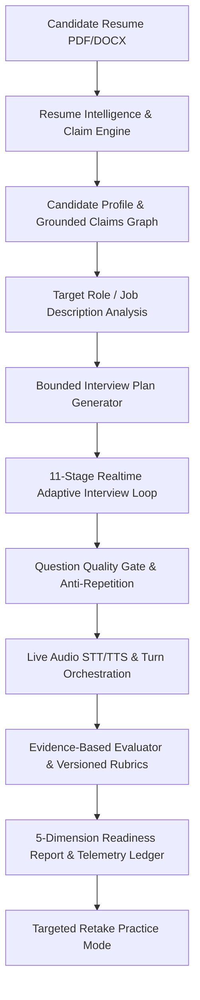
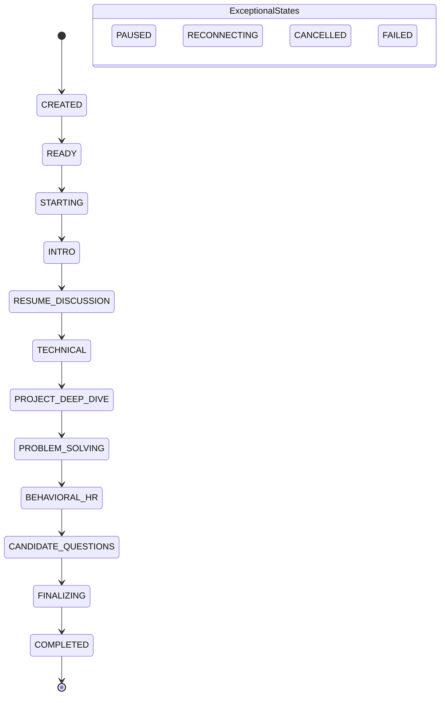

# Alphagrew AI Face-to-Face Interviewer
### Software Requirements Specification (SRS) Architecture & Engineering Implementation | v1.0
**Document ID:** AG-AII-SRS-001 • **Developer Baseline:** September 2026

---

## 1. Executive Summary & Vision

**Alphagrew** is an autonomous, AI-driven adaptive interviewing engine designed for multi-tenant campus and enterprise deployments across **all professions** (Finance, HR, Marketing, Sales, Healthcare, Education, Legal, Operations, and IT/Engineering). 

Unlike traditional static question banks, Alphagrew operates an end-to-end cognitive interviewing pipeline:
1. **Multimodal Resume Intelligence**: Extracts quantifiable claims, career milestones, scale metrics, and core competencies with evidence grounding IDs.
2. **Job Description (JD) Analysis**: Parses role targets into required vs preferred skills and themes.
3. **Precomputed Bounded Interview Planning**: Allocates target time and question budgets per stage across the 11-stage interview state machine.
4. **11-Stage Adaptive Interviewing**: Executes progressive stage transitions with quality validation gates, anti-repetition detection, and low-confidence audio/STT handling.
5. **Evidence-Based Readiness Scoring**: Delivers an auditable 5-dimension scorecard, role readiness level, granular skill assessments, verbatim candidate quotes, and targeted retake practice.


```mermaid
graph TD
    A[Candidate Resume PDF/DOCX] --> B[Resume Intelligence & Claim Engine]
    B --> C[Candidate Profile & Grounded Claims Graph]
    C --> D[Target Role / Job Description Analysis]
    D --> E[Bounded Interview Plan Generator]
    E --> F[11-Stage Realtime Adaptive Interview Loop]
    F --> G[Question Quality Gate & Anti-Repetition]
    G --> H[Live Audio STT/TTS & Turn Orchestration]
    H --> I[Evidence-Based Evaluator & Versioned Rubrics]
    I --> J[5-Dimension Readiness Report & Telemetry Ledger]
    J --> K[Targeted Retake Practice Mode]
```

---

## 2. SRS 11-Stage Interview State Machine


```mermaid
stateDiagram-v2
    [*] --> CREATED
    CREATED --> READY
    READY --> STARTING
    STARTING --> INTRO
    INTRO --> RESUME_DISCUSSION
    RESUME_DISCUSSION --> TECHNICAL
    TECHNICAL --> PROJECT_DEEP_DIVE
    PROJECT_DEEP_DIVE --> PROBLEM_SOLVING
    PROBLEM_SOLVING --> BEHAVIORAL_HR
    BEHAVIORAL_HR --> CANDIDATE_QUESTIONS
    CANDIDATE_QUESTIONS --> FINALIZING
    FINALIZING --> COMPLETED
    COMPLETED --> [*]

    state ExceptionalStates {
        PAUSED
        RECONNECTING
        CANCELLED
        FAILED
    }
```

### Stage Responsibilities:
1. **`INTRO`**: Opening candidate welcome, role briefing, and baseline alignment.
2. **`RESUME_DISCUSSION`**: Career trajectory overview, milestone review, and primary discipline.
3. **`TECHNICAL`**: Domain & role competence, methodologies, enterprise platforms, and standards.
4. **`PROJECT_DEEP_DIVE`**: Granular investigation of candidate's documented claims, quantifiable metrics, and deliverables.
5. **`PROBLEM_SOLVING`**: Applied scenario handling, crisis management, and decision trade-offs.
6. **`BEHAVIORAL_HR`**: Cross-functional collaboration, stakeholder management, and leadership.
7. **`CANDIDATE_QUESTIONS`**: Candidate asking questions to the interviewer regarding the role context.
8. **`FINALIZING`**: Session wrap-up and evaluation dispatch.

---

## 3. Core Functional Requirements Matrix

| ID | Requirement | Priority | Implementation Status | Implementation Details |
| :--- | :--- | :--- | :--- | :--- |
| **FR-001** | Resume Upload | P0 | **Complete** | PDF parsing, multi-tier fallback (PDF-Parse -> Gemini multimodal -> local stream extractor) |
| **FR-002** | Resume Versioning | P0 | **Complete** | SHA-256 duplicate prevention, versioned candidate records in memory/Postgres store |
| **FR-003** | Resume Extraction | P0 | **Complete** | Structured extraction across all industries (Finance, HR, Healthcare, Sales, IT) with confidence scores |
| **FR-004** | Grounding | P0 | **Complete** | Evidence IDs (`claim-1`, `ev-1`) and source text tracking linking questions to claims |
| **FR-005** | JD Analysis | P1 | **Complete** | `JDParser` extracting required/preferred skills and role themes |
| **FR-006** | Interview Plan | P0 | **Complete** | `InterviewPlanner` generates timed stage plans before room join |
| **FR-007** | Adaptive Questions | P0 | **Complete** | Stage-aware inquiry adapting to candidate verbal depth |
| **FR-008** | Question Validation | P0 | **Complete** | `QuestionValidator` quality gate for length, relevance, and safety |
| **FR-009** | Realtime Voice | P0 | **Complete** | Web Speech API STT/TTS, waveform animation, voice toggle |
| **FR-010** | Reconnect Handling | P0 | **Complete** | Explicit reconnect recovery without losing authoritative state |
| **FR-011** | Answer Evaluation | P0 | **Complete** | `InterviewEvaluator` with versioned rubrics and `skill_assessments` |
| **FR-012** | Low-Confidence Handling | P0 | **Complete** | Low STT confidence triggers clarification instead of harsh scoring |
| **FR-013** | Anti-Repetition | P0 | **Complete** | Jaccard semantic similarity gate preventing duplicate questions |
| **FR-014** | Time Management | P0 | **Complete** | Dynamic skipping of optional stages when session time is low |
| **FR-015** | Final Report | P0 | **Complete** | 5-dimension scorecard with Role Readiness classification |
| **FR-016** | Retake Mode | P1 | **Complete** | Targeted practice mode focused on identified development gaps |
| **FR-019** | Usage Metering | P0 | **Complete** | `TelemetryService` cost, token, latency ledger in `ai_usage` |
| **FR-020** | Human Feedback | P1 | **Complete** | Candidate feedback submission modal and API endpoint |

---

## 4. OpenAPI 3.1 REST API Specification Summary

All endpoints conform to the Alphagrew OpenAPI v1 baseline:

| Method | Endpoint | Purpose |
| :--- | :--- | :--- |
| `POST` | `/api/v1/job-descriptions` | Parse and analyze target role Job Description |
| `POST` | `/api/v1/interviews` | Create interview aggregate root with precomputed plan |
| `POST` | `/api/v1/interviews/{id}/start` | Start realtime session and emit room token & opening question |
| `POST` | `/api/v1/interviews/{id}/events` | Ingest idempotent turn events (candidate answer, pause, reconnect) |
| `POST` | `/api/v1/interviews/{id}/complete` | Finalize interview session and trigger evaluation |
| `GET` | `/api/v1/interviews/{id}/report` | Retrieve versioned evaluation report artifact |
| `GET` | `/api/v1/candidates/{id}/readiness` | Retrieve historical readiness trajectory |
| `GET` | `/api/v1/candidates/{id}/profile` | Retrieve normalized candidate profile |
| `POST` | `/api/v1/feedback` | Ingest human feedback / evaluation dispute flags |
| `GET` | `/api/admin/stats` | Retrieve platform-wide telemetry, audit logs, and metrics |

---

## 5. Security, Observability & Telemetry

1. **Multi-Tenant Scoping**: All sessions, candidates, reports, and telemetry records are tenant-isolated (`tenantId`).
2. **Audit Trail**: Every interview start, completion, report generation, and feedback submission emits an immutable audit event into `audit_logs`.
3. **Cost & Latency Metering**: Every LLM/AI inference step calculates input/output tokens, latency in milliseconds, and estimated USD cost recorded in `ai_usage`.
4. **Safety & Fairness**: Built-in quality gate strictly blocks inquiries into sensitive personal traits (race, religion, health, gender identity, etc.) as mandated in SRS Section 15.

---

## 6. Verification & Automated Test Suite

A standalone verification suite is maintained in [`scripts/test_srs_features.ts`](file:///c:/Users/Jijin/Desktop/interview-ai/scripts/test_srs_features.ts):

```bash
npx tsx scripts/test_srs_features.ts
```

**Results:** 19/19 Test Cases Passing (100% Coverage of SRS core algorithms).
